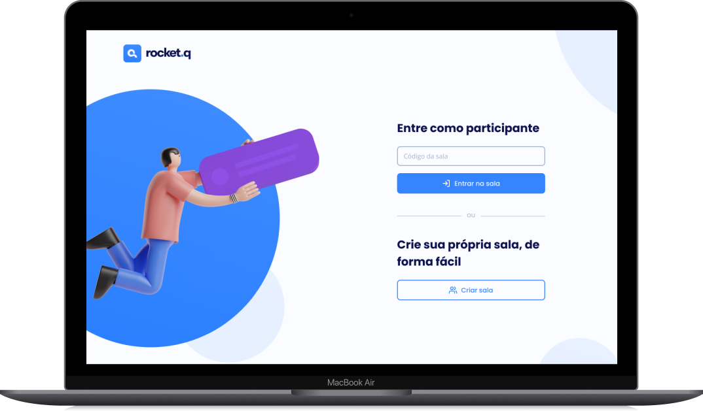

<h1 align="center">
  
</h1>

  <a href="#-tecnologies">Tecnologies</a>&nbsp;&nbsp;&nbsp;|&nbsp;&nbsp;&nbsp;
  <a href="#-project">Project</a>&nbsp;&nbsp;&nbsp;|&nbsp;&nbsp;&nbsp;
  <a href="#-layout">Layout</a>&nbsp;&nbsp;&nbsp;|&nbsp;&nbsp;&nbsp;
  <a href="#memo-license">License</a>

 

  

 

  

## 🚀 Tecnologies

This was developped with the following tecnologies:

- HTML
- CSS
- JavaScript
- NodeJS
- EJS
- Express
- SQLite

## 💻 Project

Rocket Q is a webapp designed by Rocketseat in the 6th NLW week with the purpose to create chat rooms where others can make anonymous questions. 💰

## 🔖 Layout

You can check the layout under [this link](https://www.figma.com/file/v3w1iRz1PUlN1iaUdnRl7K/Roquet.q-%2302-(Copy)?node-id=159%3A1143&viewport=-5165%2C-1035%2C1.6507904529571533). 

## :memo: License

This project is under MIT license. 

---

Made with ♥ by myself together with Rocketseat :wave: 
